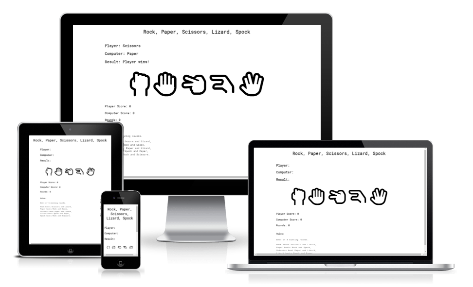
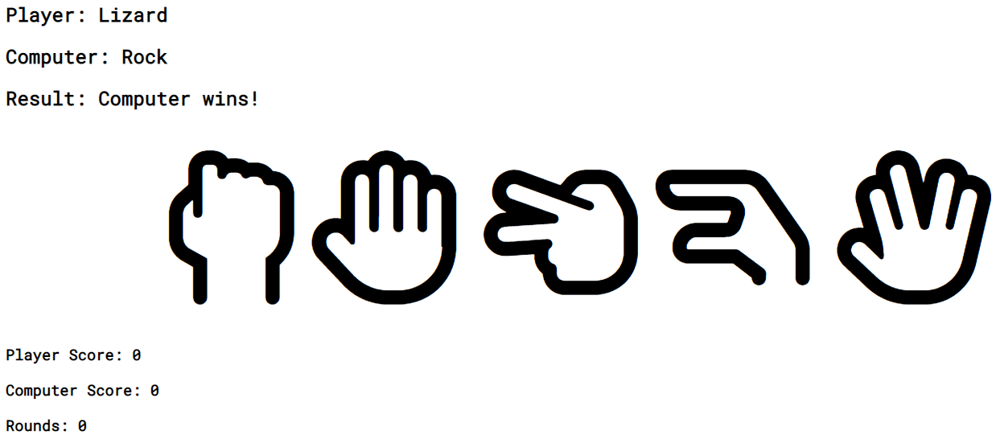
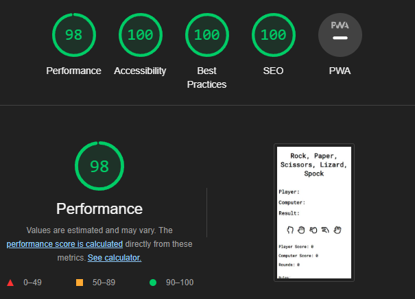

# Rock, Paper, Scissors, Lizard, Spock Game

Rock, Paper, Scissors, Lizard, Spock, a game of chance, will help you settle any decision, dispute or matter you have. This game is an extended version of the original game (Rock, Paper, Scissors) and adds even more excitement with the additional possible choices of Lizard and Spock! 

The target audience, players of all ages, are provided with the full rules of Rock, Paper, Scissors, Lizard, Spock. And while the aim of the game is to have fun and beat the computers score, the player can apply the outcome of the game on personal matters, such as deciding on what to eat for dinner or what shirt to wear to that party on Friday. 

 

## Features

 

### Existing features 

- Header
    - At the top of the page, the header displays the game name: Rock, Paper, Scissors, Lizard, Spock in a tasteful font that provides full contrast with the background. 
    - The header clearly displays the name of the game for the player. 

 

 

- The Game Area 
    - The game area includes a choice of five options to choose from to play: Rock, Paper, Scissors, Lizard or Spock. The options are interactive buttons displayed as icons representing the five classic handshaped options. 
    - The player clicks the interactive button of their choosing to play the game. 

 

 

- The Game Results
    - When the player clicks an option, the JavaScript code randomly generates a choice for the Computer. 
    - Both the Player and Computer choices, along with the resulting winner, is displayed in the top left corner of the game area. 
    - The player can follow their own and the Computers score, along with how many rounds have been played, with the score tracker in the bottom left corner. 
    - The game results are easy to follow as they are displayed in a clear way for the player. 

 

- Footer
    - The footer section contains the rules of the game, specifically what option beats what and that the game is reset to 0 once either Player or Computer have won 5 rounds. 
    - The footer section is important as it informs the player the game mechanics. 

 

 

### Features Left to Implement

- Add an alert telling the player who won five rounds first. 
- Add a function to reset the Player choice, Computer choice and Results display when five rounds have been played. 
- Add button name displayed on each button: Rock, Paper, Scissors, Lizard, Spock. 
- Add style to interactive button when clicked, providing a clearer connection to the players choice.

 

## Testing

- I have playtested the game in browsers: Chrome, Firefox, Edge. 
- I confirmed the game results are always correct. 
- I confirmed the header, footer, results and score tracker are easy to read and understand. 
- I confirmed the site is responsive and functions as intended on all standard screen sizes using the devtools device toolbar. 
- I confirmed the site is accessible and easy to read by running it through devtools lighthouse. 

 

 

## Validator Testing

- HTML
    - No errors were returned when passing through the official [W3C validator](https://validator.w3.org/)
- CSS 
    - No errors were returned when passing through the official [(Jigsaw) validator](https://jigsaw.w3.org/css-validator/)
- JavaScript 
    - No errors were returned when passing through the official [Jshint validator](https://jshint.com/)
        - The following metrics were returned: 
        - There are 3 functions in this file.
        - Function with the largest signature take 0 arguments, while the median is 0.
        - Largest function has 72 statements in it, while the median is 4. 
        - The most complex function has a cyclomatic complexity value of 45 while the median is 1.

## Deployment 
- The site was deployed to GitHub pages. The steps to deploy are as follows:
    - In the GitHub repository, navigate to the Settings tab
    - From the source section drop-down menu, select the Main Branch
    - Once the main branch has been selected, the page will provide the link to the completed website. 

The live link can be found here: [Rock, Paper, Scissors, Lizard, Spock Game](https://csilfverskiold.github.io/rpsls/)